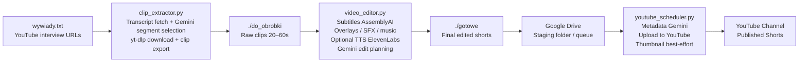

# Interview Shorts Pipeline


An end-to-end Python pipeline for turning long-form interviews into short-form YouTube content.  
It automates clip discovery, raw clip extraction, AI-assisted editing, metadata generation, and scheduled publishing into a repeatable content production workflow.

## Managed Channels (100% automated by this code)

- **PitchWarrior** — https://www.youtube.com/@PitchWarriorr  
  

- **TheInterviewEmpire** — https://www.youtube.com/@TheInterviewEmpire  
  
  
---

## Project Overview

`interview-shorts-pipeline` solves a very practical media automation problem:

> Long interviews contain many high-value moments, but finding, cutting, editing, packaging, and publishing them manually is slow and repetitive.

This project compresses that workflow into a structured pipeline:

1. ingest a long YouTube interview,
2. extract promising short-form moments,
3. transform them into edited vertical clips,
4. enrich them with subtitles, overlays, audio effects, and metadata,
5. stage them for distribution and publish them automatically on schedule.

From an engineering perspective, the interesting part is not just the editing itself, but the **orchestration across multiple APIs and media-processing stages**:
- transcript retrieval and parsing,
- LLM-based segment selection,
- deterministic video slicing,
- AI-assisted post-processing,
- OAuth-based Google integrations,
- scheduled publishing with fallbacks.

This repository is intended as a **portfolio project** that demonstrates applied software engineering in automation, media tooling, API integration, and production-style scripting.

---

## Why this project?

Most portfolio projects stop at a single isolated script or model demo. This one does not.

This repository demonstrates the ability to design and implement a **multi-stage automation system** that combines:

- external API integration,
- LLM prompting and structured output validation,
- media transformation with real file I/O,
- resilience via fallbacks,
- scheduled job execution,
- separation of pipeline stages for operational clarity.

It is a strong example of building a system that creates business value by reducing manual content operations and increasing throughput.

---

## Architecture & Pipeline Flow

**High-level flow**

`Long-form interview URL`  
→ `Transcript fetch + LLM clip selection`  
→ `Raw clip extraction`  
→ `AI-assisted vertical editing + subtitles + overlays + commentary`  
→ `Finished videos staged in Drive`  
→ `Scheduled YouTube upload + metadata generation`




### Pipeline stages

#### 1) `clip_extractor.py`
Reads interview URLs from `wywiady.txt`, fetches the YouTube transcript, chunks long transcripts, asks Gemini to identify the most compelling short-form segments, resolves transcript indices to timestamps, downloads the full source video, and exports raw clips to `./do_obrobki`.

#### 2) `video_editor.py`
Processes raw clips from `./do_obrobki` and produces final edited videos in `./gotowe`.  
This stage can add:
- word-level subtitles,
- AI-generated visual overlays,
- TTS commentary interruptions,
- background music,
- an outro hook / engagement prompt.

#### 3) `youtube_scheduler.py`
Takes completed videos from a Google Drive staging folder, downloads one item per run, generates title/description metadata with Gemini, uploads to YouTube, optionally sets a thumbnail, and deletes the source file from Drive after successful publication.

#### 4) `gen_token.py`
Utility script for generating OAuth tokens locally for different Google scopes/accounts.  
This is intentionally kept flexible because it can be reused to generate multiple tokens by switching the configured scope/output file.

---

## Repository Layout

```text
.
├── clip_extractor.py
├── video_editor.py
├── youtube_scheduler.py
├── gen_token.py
├── README.md
└── (local-only, not committed)
    ├── .env
    ├── wywiady.txt
    ├── do_obrobki/
    ├── gotowe/
    ├── work/
    ├── music/
    ├── client_secret.json
    ├── client_secret_sport.json
    ├── token_interview.json
    ├── token_interview_sport.json
    └── gemini_config.json
```

---

## Tech Stack & Tools

### Core Language
- **Python**
  - Chosen for fast iteration, rich media tooling, and strong API ecosystem support.

### LLM / AI
- **Google Gemini**
  - Used in multiple places:
    - transcript-to-clip selection,
    - video-aware planning for edits/overlays/commentary,
    - title and description generation for YouTube uploads.
- **AssemblyAI**
  - Used for word-level transcription to support subtitle timing and transcript-aware editing constraints.
- **ElevenLabs**
  - Used for optional commentary / outro TTS generation.

### Video / Audio Processing
- **MoviePy**
  - Core video assembly, compositing, subtitle rendering, and audio mixing.
- **FFmpeg**
  - Required runtime dependency under the hood for video export workflows.
- **ImageMagick**
  - Required by `TextClip` workflows in MoviePy, especially on Windows.
- **Pillow**
  - Used for image manipulation and filter-based visual effects.

### YouTube / Google Integrations
- **YouTube Data API**
  - Uploading videos and updating thumbnails.
- **Google Drive API**
  - Used as a simple staging queue for finished assets.
- **OAuth 2.0**
  - Local token generation and account-scoped authentication.

### Supporting Libraries
- **yt-dlp** for source video download
- **youtube-transcript-api** for transcript retrieval
- **Pydantic** for schema validation of LLM outputs
- **python-dotenv** for environment-based configuration
- **requests / numpy / standard library tooling** for API calls, transformations, and pipeline glue

---

## Key Features & Technical Achievements

- **Transcript chunking for long-form media**
  - Long interviews are split into manageable transcript windows before LLM analysis, allowing the clip selection stage to scale to multi-hour content.

- **Schema-validated LLM outputs**
  - LLM responses are parsed into typed structures using Pydantic rather than trusted blindly, which is a strong engineering pattern for reliability.

- **Transcript index → timestamp resolution**
  - The clip extraction stage maps model-selected transcript line ranges back to concrete video time ranges, including normalization and defensive handling for off-by-one or out-of-range outputs.

- **Video-first editing plan generation**
  - The editing stage does not rely only on text; it uploads the actual MP4 clip to Gemini so the model can plan overlays, hooks, and commentary based on the clip itself.

- **Word-level subtitle timing**
  - AssemblyAI transcription is used to support more precise subtitle generation and better alignment with edit timing.

- **Multi-layer compositing pipeline**
  - Final videos can combine subtitles, background music, visual overlays, commentary inserts, sound effects, and outro prompts in a single render flow.

- **Best-effort, resilient fallbacks**
  - The system degrades gracefully when some services are unavailable:
    - metadata falls back to defaults,
    - optional TTS can be skipped,
    - thumbnail upload is best-effort rather than a hard failure,
    - missing subtitle APIs degrade functionality rather than stop the whole pipeline.

- **Separation of Google identities/scopes**
  - Drive and YouTube authentication are treated as separate credentials/scopes, which is a more realistic and operationally safe design than collapsing everything into one token.

- **Scheduled publishing workflow**
  - Uploading is designed as a daemon-style scheduled process rather than a one-off script, making the project closer to a real content operations system.

---

## External Services Used

This project integrates with several external APIs. The table below shows **where** each service is used and **what must be configured locally**.

| Service | Used In | Purpose | Local Setup Required |
|---|---|---|---|
| Google Gemini | `clip_extractor.py` | Select best transcript segments | `GEMINI_API_KEY` in `.env` |
| Google Gemini | `video_editor.py` | Plan overlays/commentary and generate assets | `GOOGLE_API_KEY` or `GEMINI_API_KEY`, or local `gemini_config.json` |
| Google Gemini | `youtube_scheduler.py` | Generate YouTube title + description | `GEMINI_API_KEY` |
| YouTube Transcript API | `clip_extractor.py` | Fetch transcript from source interview | No secret required |
| yt-dlp | `clip_extractor.py` | Download source interview video | No secret required |
| AssemblyAI | `video_editor.py` | Word-level transcription for captions | `ASSEMBLYAI_API_KEY` |
| ElevenLabs | `video_editor.py` | Optional TTS commentary/outro | `ELEVENLABS_API_KEY`, `ELEVENLABS_VOICE_ID` |
| Google Drive API | `youtube_scheduler.py` | Pull completed videos from staging folder | OAuth client secret + token |
| YouTube Data API | `youtube_scheduler.py`, `gen_token.py` | Upload videos and validate token/channel | OAuth client secret + token |

---

## Local Setup & Installation

### 1) Prerequisites

Install the following first:

- **Python 3.10+**
- **FFmpeg**
- **ImageMagick**  
  Required for MoviePy text rendering workflows.
- A **Google Cloud project** with:
  - YouTube Data API enabled
  - Google Drive API enabled
  - OAuth client credentials created
- API keys for:
  - Gemini
  - AssemblyAI *(recommended)*
  - ElevenLabs *(optional, only if you want TTS commentary/outros)*

---

### 2) Clone the repository

```bash
git clone https://github.com/SatukerRekiner/interview-shorts-pipeline.git
cd interview-shorts-pipeline
```

---

### 3) Create and activate a virtual environment

#### macOS / Linux
```bash
python3 -m venv .venv
source .venv/bin/activate
```

#### Windows (PowerShell)
```powershell
python -m venv .venv
.venv\Scripts\Activate.ps1
```

---

### 4) Install Python dependencies

```bash
pip install --upgrade pip
pip install google-generativeai youtube-transcript-api yt-dlp moviepy python-dotenv pydantic requests numpy pillow assemblyai google-auth google-auth-oauthlib google-api-python-client
```

---

### 5) Create local-only files and folders

These should exist locally:

```bash
mkdir -p do_obrobki gotowe work music
touch wywiady.txt
touch .env
```

---

### 6) Configure environment variables

Create a `.env` file in the project root:

```env
# Required for clip selection and upload metadata generation
GEMINI_API_KEY=your_gemini_api_key_here

# Optional alternative name used by video_editor.py
GOOGLE_API_KEY=your_gemini_api_key_here

# Recommended for subtitle timing in video_editor.py
ASSEMBLYAI_API_KEY=your_assemblyai_api_key_here

# Optional: enables TTS commentary and outro generation
ELEVENLABS_API_KEY=your_elevenlabs_api_key_here
ELEVENLABS_VOICE_ID=your_voice_id_here

# Optional ElevenLabs tuning
ELEVENLABS_MODEL_ID=eleven_turbo_v2_5
ELEVENLABS_STABILITY=0.5
ELEVENLABS_SIMILARITY_BOOST=0.75
ELEVENLABS_STYLE=0.0
```

### Optional Gemini config file
`video_editor.py` can also read a local JSON config instead of environment variables:

```json
{
  "api_key": "your_gemini_api_key_here"
}
```

Save that as:

```text
gemini_config.json
```

Using environment variables is cleaner; the JSON file exists as a supported fallback.

---

## OAuth Setup & Token Generation

This repository intentionally does **not** include Google OAuth client secret files or generated tokens.

You must create your own local credentials and tokens.

### Files expected locally

Depending on how you configure `youtube_scheduler.py`, you will typically need local Google credential files such as:

```text
client_secret.json
client_secret_sport.json
token_interview.json
token_interview_sport.json
```

### Using `gen_token.py`

`gen_token.py` is a reusable utility for generating OAuth tokens for different scopes/accounts.

Because the file is intentionally flexible, you should edit these constants before running it:

- `SCOPES`
- `CLIENT_SECRETS_FILE`
- `TOKEN_FILE`

Then run:

```bash
python gen_token.py
```

Typical usage pattern:
1. generate a **YouTube upload token**,
2. optionally switch the scope and output filename,
3. generate a **Drive token** for the staging account/folder.

> In my workflow, I use `gen_token.py` to pre-generate tokens locally.  
> The uploader can also refresh/recreate credentials if the expected client secret files are available.

---

## How to Run the Pipeline Locally

### Step 1: Add source interviews

Put one YouTube URL per line into:

```text
wywiady.txt
```

Example:

```text
https://www.youtube.com/watch?v=XXXXXXXXXXX
https://www.youtube.com/watch?v=YYYYYYYYYYY
```

---

### Step 2: Extract raw clips

```bash
python clip_extractor.py --interviews-file wywiady.txt --language en --output-dir do_obrobki --download-dir downloads --max-clips 4
```

What this does:
- fetches the transcript,
- asks Gemini to identify strong clip candidates,
- downloads the original interview,
- exports raw clips to `./do_obrobki`.

---

### Step 3: Review / curate raw clips

At this point, `./do_obrobki` contains raw extracted clips.  
You can quickly review them and optionally delete any that you do not want to keep.

---

### Step 4: Produce final edited shorts

```bash
python video_editor.py
```

What this does:
- reads raw clips from `./do_obrobki`,
- adds subtitles and AI-guided edits,
- writes final videos to `./gotowe`.

> If `ASSEMBLYAI_API_KEY` is missing, subtitle-related behavior will be reduced.  
> If ElevenLabs variables are missing, TTS commentary/outro features are skipped.

---

### Step 5: Stage videos for upload

Move or upload the finished videos from `./gotowe` into your configured Google Drive folder.

This Drive folder acts as a simple publishing queue for `youtube_scheduler.py`.

---

### Step 6: Run the scheduler/uploader

For a single test execution:

```bash
python youtube_scheduler.py --once
```

For daemon/scheduled mode:

```bash
python youtube_scheduler.py
```

What this does:
- polls the configured Google Drive folder,
- downloads one staged video,
- generates title and description with Gemini,
- uploads the video to YouTube,
- attempts to set a thumbnail,
- removes the processed file from Drive after success.

---


## Future Enhancements

If I were taking this from a strong portfolio project to a production-grade system, the next steps would be:

- **Centralized configuration layer**
  - Replace hardcoded paths/constants with a typed config module or environment-driven settings.

- **Job state tracking**
  - Add a database or queue-backed state machine to track each asset through extraction, edit, staging, and publish phases.

- **Containerization**
  - Package the pipeline with Docker for reproducible local and server deployment.

- **CI/CD and automated validation**
  - Add tests for transcript parsing, clip timing resolution, metadata parsing, and configuration validation.

- **Parallel processing**
  - Process multiple clips concurrently where media I/O and rendering allow it.

- **Observability**
  - Add structured logs, metrics, retry policies, and failure alerts.

- **Web dashboard / operator UI**
  - Allow reviewing extracted clips, approving edits, and tracking upload status from a small internal interface.

- **Stronger idempotency guarantees**
  - Prevent duplicate processing or duplicate uploads across retries and restarts.

---


## Summary

`interview-shorts-pipeline` is a practical, multi-stage automation system that combines LLMs, media processing, and platform APIs into a cohesive workflow.

It is the kind of project I would want in a software engineering portfolio because it demonstrates:
- applied problem-solving,
- real-world API integration,
- media pipeline orchestration,
- robustness under imperfect external systems,
- and the ability to turn messy manual work into repeatable software.
